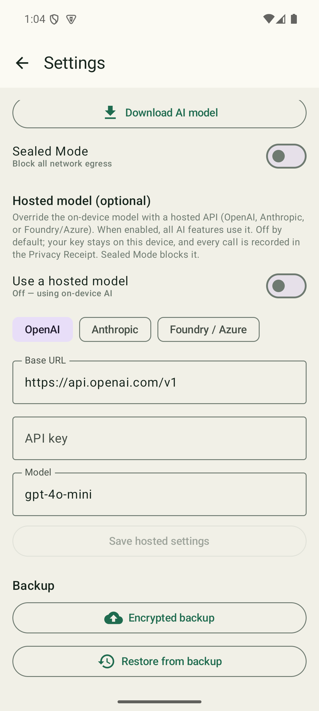

<!--
  PUBLIC REPO — Nema-Release.
  This repository is the public storefront for the Nema app. It contains ONLY
  the signed release APK (attached to GitHub Releases), checksums, and public
  documentation. NO source code, build files, secrets, or internal docs belong
  here. See AGENTS.md in the private Nema-Internal repo for the full policy.
-->

# Nema

**Chat-style note taking.** Nema turns note-taking into the messaging pattern
you already use every day: **notebooks are chats, notes are messages, and
capturing a thought is as fast as sending a text.**

> **Latest release: [Nema v2.1.0](../../releases/latest)** · Android 8.0+ · on-device AI, private by design

- 💬 **Texting-speed capture** — open, type, send. Your note is saved instantly.
- 🗂️ **Organize by topic** — a notebook per subject (Gym Log, Food Log, Ideas),
  with pinning so this week's priorities float to the top.
- 🔍 **Find anything** — fast global and in-notebook search with date ranges.
- ✨ **On-device AI** — redraft, ask, summarize, extract, and run Skills — all
  running **locally on your phone** by default. No cloud, no account.
- ☁️ **Bring your own model (optional)** — power the same AI features with your
  own OpenAI, Anthropic, or Foundry/Azure API key instead. Off by default; your
  key stays on your device.
- 🔒 **Private by design** — the on-device model needs no network at all. Any
  network use (the optional model download, or a hosted model you opt into) is
  logged in the Privacy ledger and can be turned off entirely with **Sealed
  Mode**. Without a model, Nema is a fully offline notebook.

> Nema is an Android app. The intelligence runs on your device.

---

## 📱 Screenshots

<table>
  <tr>
    <td align="center"><br><sub>Notebooks — pinned & all</sub></td>
    <td align="center"><br><sub>Capture like texting</sub></td>
    <td align="center"><br><sub>Search everything</sub></td>
    <td align="center"><br><sub>Bring your own model <em>(new)</em></sub></td>
  </tr>
</table>

---

## 📥 Download & install

1. Go to the [**latest release**](../../releases/latest).
2. Download `nema-v2.1.0-release.apk`.
3. (Recommended) Verify the download — see **Verifying your download** below.
4. On your Android device, open the APK and allow installation from this source
   if prompted.

> Nema is distributed as a signed APK here. Sideloading requires enabling
> "Install unknown apps" for your browser/file manager.

### Verifying your download

Every release APK ships with a matching `…​.apk.sha256` checksum file. To verify
integrity:

```bash
# Compare the printed hash against the contents of the .sha256 file
sha256sum nema-v2.1.0-release.apk         # Linux / macOS
Get-FileHash nema-v2.1.0-release.apk      # Windows PowerShell (SHA256 by default)
```

The hashes must match exactly. If they don't, do not install the file.

---

## ✨ Features

- **Notebooks-as-chats** with pin/unpin to prioritize.
- **Instant note capture** — nothing ever sits between you and saving a note.
- **Two-tier search** (global / in-notebook) with date-range filters.
- **Local-first storage** that survives reinstall; encrypted local backup/export.
- **AI Redraft (✨)** — tidy, shorten, expand, or bulletize a draft before you
  send it; your original is never lost.
- **/ask & /compact** — answer questions grounded only in your notes (with source
  chips), or summarize a notebook. Hybrid search + on-device embeddings.
- **Extraction rules** — describe what to pull from your notes in plain language;
  AI builds a live table with rollups, tap-to-source, editing, and CSV export.
- **Skills** — reusable prompts you attach to notebooks and run on demand, on a
  schedule, or when you add a note. Permissions default to read-only.
- **Bring your own hosted model (optional)** — flip a switch in Settings to power
  every AI feature with your own OpenAI, Anthropic, or Foundry/Azure API instead
  of the on-device model. Off by default; on-device stays the default.
- **Privacy ledger & Sealed Mode** — every network egress (the optional model
  download, or a hosted model you opt into) is logged; Sealed Mode blocks it all.

---

## 🆕 What's new in v2.1.0

Nema now lets you **bring your own hosted model**. If you'd rather power the AI
features with a cloud API than the on-device model, open **Settings → Hosted
model**, flip the switch, and add your **OpenAI**, **Anthropic**, or
**Foundry/Azure** endpoint, key, and model name. Once enabled, every AI feature —
redraft, `/ask`, `/compact`, extraction, and Skills — routes through your hosted
model. It's **off by default**, on-device remains the default, your key stays on
your device, and every hosted call is recorded in the Privacy Receipt and
blockable with Sealed Mode. See the [`CHANGELOG.md`](CHANGELOG.md) for the full
history.

---

## 🔐 Privacy

Nema's AI runs **on your device** by default, and that path makes **zero** network
calls. Nema only touches the network in two cases, both under your control:

- **The optional model download** — an on-demand download to enable the on-device
  AI features.
- **A hosted model you opt into** — if you turn on a hosted model in Settings, your
  requests go to the endpoint you configured. This is **off by default** and your
  API key stays on your device.

Both are:

- **Ledgered** — every egress is recorded (host, bytes, purpose; never your note
  content) in the in-app Privacy Receipt.
- **Blockable** — turn on **Sealed Mode** to block all egress, including hosted
  calls; the app keeps working as an offline notebook.
- **Optional** — with no model downloaded and hosting off, Nema makes no network
  calls and is a fully offline v1-style notebook.

Your notes are never sent anywhere unless you explicitly enable a hosted model.

---

## 📝 Changelog

See [`CHANGELOG.md`](CHANGELOG.md) for the history of user-facing changes.

---

## 📄 License

Nema is released under the [MIT License](LICENSE) — © 2026 Ajay Sharma.

---

## ℹ️ About this repository

This is the **public release** repository. The application source code is
maintained privately. Issues and feedback about installing or using released
builds are welcome here; the source itself is not published.
