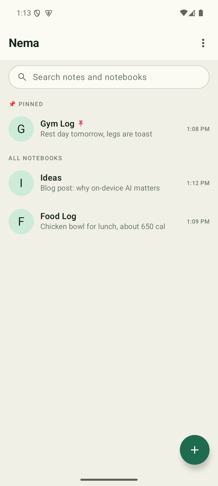
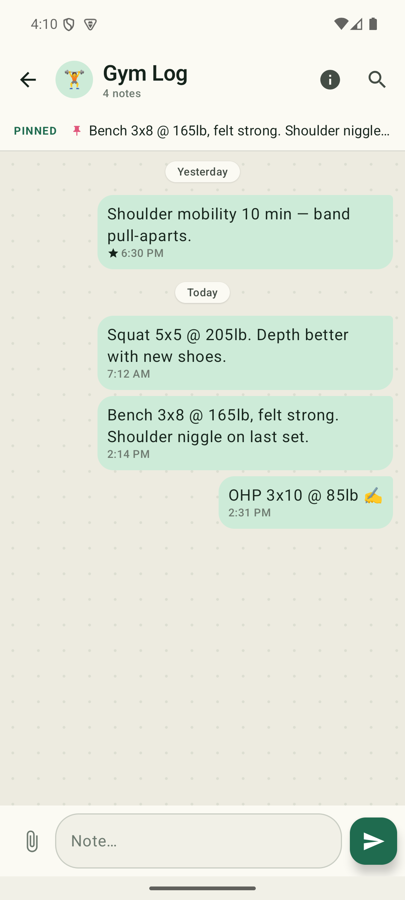
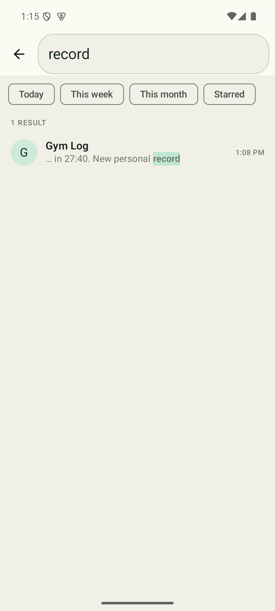

<!--
  PUBLIC REPO — Nema-Release.
  This repository is the public storefront for the Nema app. It contains ONLY
  the signed release APK (attached to GitHub Releases), checksums, and public
  documentation. NO source code, build files, secrets, or internal docs belong
  here. See AGENTS.md in the private Nema-Internal repo for the full policy.
-->

# Nema

**Chat-style note taking.** Nema turns note-taking into the messaging pattern
you already use every day: **notebooks are chats, notes are messages, and
capturing a thought is as fast as sending a text.**

> **Latest release: [Nema v2.0.0](../../releases/latest)** · Android 8.0+ · on-device AI, private by design

- 💬 **Texting-speed capture** — open, type, send. Your note is saved instantly.
- 🗂️ **Organize by topic** — a notebook per subject (Gym Log, Food Log, Ideas),
  with pinning so this week's priorities float to the top.
- 🔍 **Find anything** — fast global and in-notebook search with date ranges.
- ✨ **On-device AI** — redraft, ask, summarize, extract, and run Skills — all
  running **locally on your phone**. No cloud, no account.
- 🔒 **Private by design** — the AI runs on-device. The only network use is the
  optional model download, which is logged in the Privacy ledger and can be
  turned off entirely with **Sealed Mode**. Without a model, Nema is a fully
  offline notebook.

> Nema is an Android app. The intelligence runs on your device.

---

## 📱 Screenshots

<table>
  <tr>
    <td align="center"><br><sub>Notebooks — pinned & all</sub></td>
    <td align="center"><br><sub>Capture like texting</sub></td>
    <td align="center"><br><sub>Search everything</sub></td>
  </tr>
</table>

---

## 📥 Download & install

1. Go to the [**latest release**](../../releases/latest).
2. Download `nema-v2.0.0-release.apk`.
3. (Recommended) Verify the download — see **Verifying your download** below.
4. On your Android device, open the APK and allow installation from this source
   if prompted.

> Nema is distributed as a signed APK here. Sideloading requires enabling
> "Install unknown apps" for your browser/file manager.

### Verifying your download

Every release APK ships with a matching `…​.apk.sha256` checksum file. To verify
integrity:

```bash
# Compare the printed hash against the contents of the .sha256 file
sha256sum nema-v2.0.0-release.apk         # Linux / macOS
Get-FileHash nema-v2.0.0-release.apk      # Windows PowerShell (SHA256 by default)
```

The hashes must match exactly. If they don't, do not install the file.

---

## ✨ Features

- **Notebooks-as-chats** with pin/unpin to prioritize.
- **Instant note capture** — nothing ever sits between you and saving a note.
- **Two-tier search** (global / in-notebook) with date-range filters.
- **Local-first storage** that survives reinstall; encrypted local backup/export.
- **AI Redraft (✨)** — tidy, shorten, expand, or bulletize a draft before you
  send it; your original is never lost.
- **/ask & /compact** — answer questions grounded only in your notes (with source
  chips), or summarize a notebook. Hybrid search + on-device embeddings.
- **Extraction rules** — describe what to pull from your notes in plain language;
  AI builds a live table with rollups, tap-to-source, editing, and CSV export.
- **Skills** — reusable prompts you attach to notebooks and run on demand, on a
  schedule, or when you add a note. Permissions default to read-only.
- **Privacy ledger & Sealed Mode** — the only network use (optional model
  download) is logged; Sealed Mode blocks it entirely.

---

## 🆕 What's new in v2.0.0

Nema's first **on-device AI** release. Notebooks get intelligent while staying
private: AI redrafting in the composer, `/ask` and `/compact` grounded in your
own notes, user-programmable **Extraction rules** that turn notes into structured
tables, and **Skills** — reusable prompts you can attach to notebooks and trigger
on demand, on a schedule, or on new notes. Everything runs on your device using a
local model; the app remains a fully-functional offline notebook if you never
download one. See the [`CHANGELOG.md`](CHANGELOG.md) for the full history.

---

## 🔐 Privacy

Nema's AI runs **on your device**. The one and only network use is the optional,
on-demand **model download** — and it is:

- **Ledgered** — every download is recorded (host, bytes, purpose; never your
  note content) in the in-app Privacy Receipt.
- **Blockable** — turn on **Sealed Mode** to block all egress; the app keeps
  working as an offline notebook.
- **Optional** — with no model downloaded, Nema makes no network calls and is a
  fully offline v1-style notebook.

Your notes never leave your device.

---

## 📝 Changelog

See [`CHANGELOG.md`](CHANGELOG.md) for the history of user-facing changes.

---

## 📄 License

Nema is released under the [MIT License](LICENSE) — © 2026 Ajay Sharma.

---

## ℹ️ About this repository

This is the **public release** repository. The application source code is
maintained privately. Issues and feedback about installing or using released
builds are welcome here; the source itself is not published.
